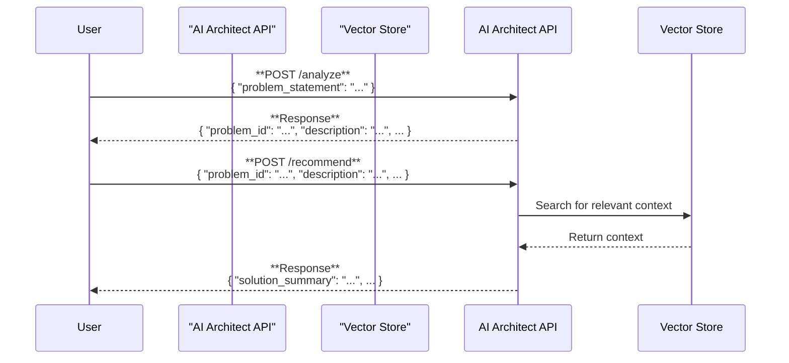

# AI Architect API: Software Design

This document outlines the software design for the AI Architect API, a tool to translate a nonprofit's challenges into actionable, AI-driven solutions.

-----

## 1\. Core Concept

The AI Architect API is designed as a two-step conversational tool that helps nonprofits articulate their problems and receive relevant AI-powered solutions. The process is as follows:

1.  **Analyze**: The API first helps to understand and structure the user's problem.
2.  **Recommend**: It then proposes a tailored solution based on the analyzed problem, grounded in a knowledge base of real-world examples.

This approach is particularly useful for nonprofits that may have a general sense of their needs (e.g., "we want to be more efficient") but require assistance in defining the problem and identifying the right technical solutions.

-----

## 2\. System Architecture

The system is built on a two-stage processing pipeline that incorporates a **Retrieval-Augmented Generation (RAG)** step to enhance recommendations. This separates problem analysis from solution generation and ensures the final output is contextually relevant.



-----

## 3\. Technical Stack

The AI Architect API will be developed using a modern, efficient, and scalable tech stack:

  * **API Framework**: **FastAPI** is chosen for its high performance, ease of use, and automatic generation of interactive API documentation.
  * **Language Model**: The **OpenAI GPT-4 API** will be used for its advanced natural language understanding and generation capabilities. A fallback mechanism will be included to handle potential API issues.
  * **Vector Store**: A simple, in-memory vector store using Sentence-Transformers and Faiss is implemented. This allows the system to perform efficient similarity searches against a curated knowledge base of successful nonprofit projects, providing grounded and context-aware recommendations.

-----

## 4\. API Endpoints

The API consists of two main endpoints, `/analyze` and `/recommend`.

### POST /analyze

  * **Purpose**: To take a vague, unstructured problem statement from a nonprofit and convert it into a structured, actionable format.
  * **Input**: A JSON object with a `problem_statement` string.
  * **Process**: The endpoint sends the `problem_statement` to the ChatGPT LLM with a specialized prompt designed to extract the core problem, summarize it, and generate clarifying questions if needed. This is based on research into implicit intent understanding to reduce unnecessary back-and-forth communication.
  * **Output**: A structured JSON object containing a unique `problem_id`, a concise `description` of the problem, and a list of `clarifying_questions`.

### POST /recommend

  * **Purpose**: To generate a tailored, actionable AI solution based on the structured problem from the `/analyze` endpoint.
  * **Input**: The exact JSON output from the `/analyze` endpoint.
  * **Process**: The structured problem description is sent to the ChatGPT LLM, along with context from the simple vector store. This allows the model to recommend a tech stack and initial steps that are relevant to the nonprofit sector.
  * **Output**: A JSON object containing a `solution_summary`, a `recommended_tech_stack`, and a list of actionable `initial_steps`.

-----

## 5\. Data Structures

The data structures are designed to be simple, clear, and efficient, using Pydantic for data validation.

### /analyze Endpoint

#### Request

```python
class AnalyzeRequest(BaseModel):
    problem_statement: str
```

#### Response

```python
class AnalyzeResponse(BaseModel):
    problem_id: str
    description: str
    clarifying_questions: List[str]
```

### /recommend Endpoint

#### Request

```python
class RecommendRequest(BaseModel):
    problem_id: str
    description: str
    clarifying_questions: List[str]
```

#### Response

```python
class RecommendResponse(BaseModel):
    solution_summary: str
    recommended_tech_stack: List[str]
    initial_steps: List[str]
```

-----

## 6\. Future Enhancements

While the initial version will provide a strong foundation, there are several opportunities for future enhancements:

  * **RAG Implementation**: The simple vector store can be upgraded to a more robust Retrieval-Augmented Generation (RAG) system with a dedicated vector database to provide more evidence-based recommendations.
  * **Multi-Agent Orchestration**: Specialized agents could be developed for different nonprofit domains (e.g., fundraising, operations) to provide more comprehensive and domain-specific solutions.
  * **Adaptive Learning**: The system could be enhanced to learn from user feedback, allowing it to adapt and improve its recommendations over time based on the organization's sector, size, and previous interactions.
