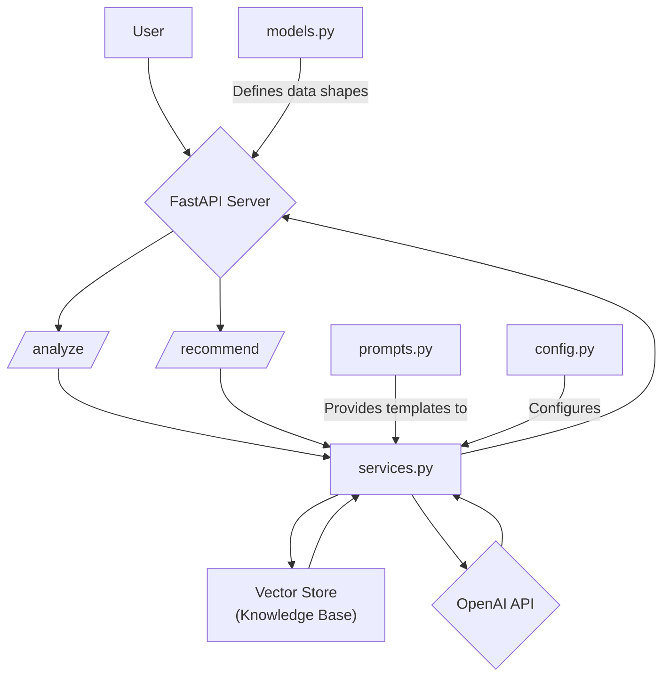
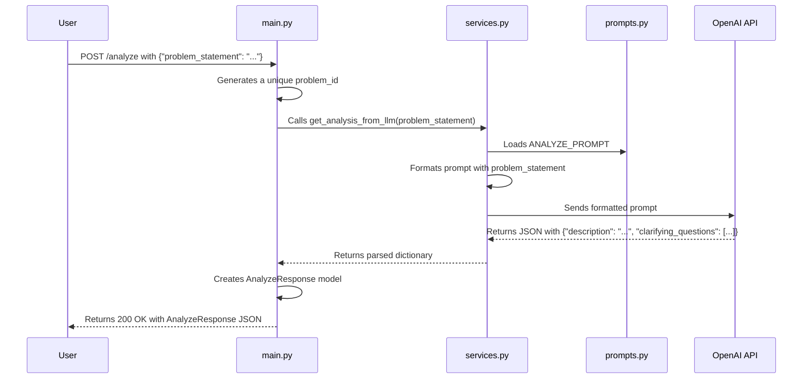
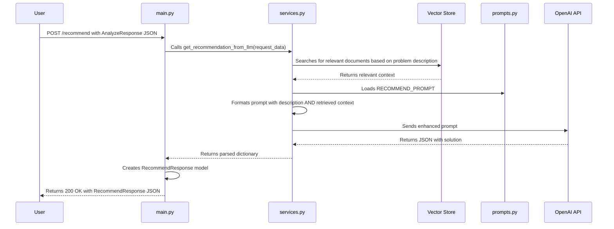

Of course. You're right to update the documentation. A deep-dive document is only useful if it accurately reflects the current state of the code. Now that you've implemented the simple vector store, the old documentation is obsolete.

Here is the updated version of `task_1_solution_architect/docs/05_documentation.md`. It now includes the Retrieval-Augmented Generation (RAG) component in the architecture, component descriptions, and code flow diagrams, ensuring it perfectly matches your new, more intelligent system.

-----

## AI Architect: Deep Dive Documentation

This document provides a detailed look into the internal workings of the AI Architect API, including its architecture, code flow, and the role of each component.

### 1\. System Architecture

The API is designed with a clear separation of concerns. The addition of a **vector store** for Retrieval-Augmented Generation (RAG) grounds the AI's recommendations in a curated knowledge base of real-world examples.

### 2\. Component Descriptions

The `src` directory contains the core logic of the application, broken down into the following modules:

  * **`main.py`**: This is the main entry point for the FastAPI application. It is responsible for:

      * Initializing the FastAPI app instance.
      * Defining the API endpoints (`/`, `/analyze`, and `/recommend`).
      * Handling incoming HTTP requests and returning HTTP responses.
      * Orchestrating calls to the service layer (`services.py`) to perform the core business logic.

  * **`models.py`**: This file defines the data structures for the API using Pydantic `BaseModel`. Its purpose is to:

      * Ensure that incoming request bodies match the expected JSON structure.
      * Validate the data types of incoming fields.
      * Serialize the outgoing response data into a well-defined JSON format.
      * Serve as a clear "data contract" for what the API expects and returns.

  * **`services.py`**: This is the business logic layer of the application. It is now responsible for:

      * **Initializing the RAG Vector Store**: On startup, it loads text files from the `knowledge_base`, creates vector embeddings, and builds a `faiss` index for efficient similarity searching.
      * **Performing Vector Search**: Before calling the LLM for a recommendation, it searches the vector store for relevant context.
      * Communicating with the external OpenAI API.
      * Formatting the prompts that are sent to the Large Language Model (LLM), now including the retrieved context.
      * Parsing the JSON responses received from the LLM.

  * **`prompts.py`**: This module centralizes all the prompt templates used to instruct the LLM. Keeping prompts in a separate file makes them easier to:

      * Read, manage, and update without changing the application logic.
      * Experiment with different prompt engineering strategies.

  * **`config.py`**: This file manages the application's configuration settings. It is responsible for:

      * Loading environment variables from a `.env` file, such as the `TTTR_API_KEY`.
      * Providing a centralized `settings` object that can be imported and used throughout the application.
      * Ensuring that critical configuration, like the API key, is present at startup.

### 3\. Code Flow and Logic

The API's functionality is delivered through a two-step process. The `/recommend` flow is now enhanced with the RAG step.

#### `/analyze` Endpoint Flow

The goal of this endpoint is to take a user's unstructured problem and convert it into a structured summary with clarifying questions.

1.  The user sends a `POST` request to `/analyze` with a JSON payload containing the `problem_statement`.
2.  The `analyze_problem` function in `main.py` receives the request. The request body is validated against the `AnalyzeRequest` model.
3.  A unique `problem_id` is generated using `uuid`.
4.  The function calls `get_analysis_from_llm` from `services.py`, passing the `problem_statement` string.
5.  In `services.py`, the `ANALYZE_PROMPT` from `prompts.py` is formatted with the user's problem statement.
6.  An API call is made to the OpenAI `chat.completions` endpoint with the prepared prompt.
7.  The LLM returns a JSON object, which is parsed in `services.py` and returned to `main.py`.
8.  `main.py` constructs an `AnalyzeResponse` object from the LLM's output and the generated `problem_id`.
9.  The `AnalyzeResponse` is sent back to the user as the HTTP response.

#### `/recommend` Endpoint Flow (with RAG)

This endpoint now uses the vector store to find relevant context before generating a concrete technical solution.

1.  The user sends a `POST` request to `/recommend` with the full JSON response they received from the `/analyze` endpoint.
2.  The `recommend_solution` function in `main.py` calls `get_recommendation_from_llm` from `services.py`.
3.  **New Step**: `services.py` encodes the problem `description` into a vector and queries the `faiss` index to find the most similar document(s) in the knowledge base.
4.  The `RECOMMEND_PROMPT` from `prompts.py` is now formatted with both the problem `description` and the **retrieved context** from the vector store.
5.  An API call is made to the OpenAI service with this enhanced, context-rich prompt.
6.  The LLM provides a technical recommendation that is now grounded in the provided real-world examples.
7.  The response is parsed and returned to the user as a `RecommendResponse` object.