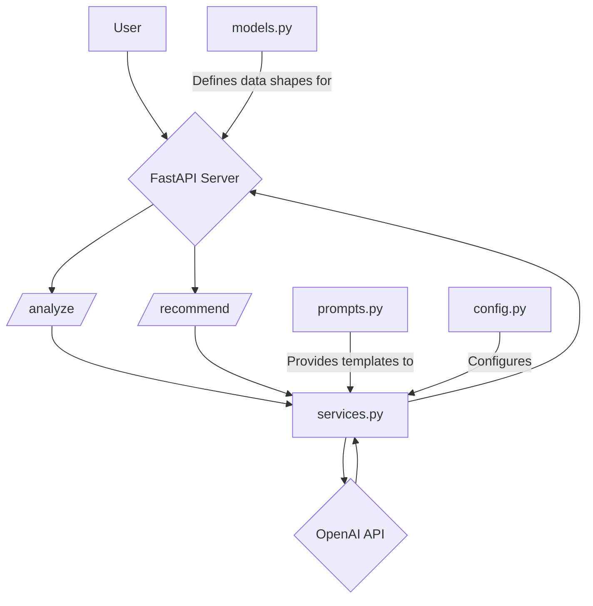
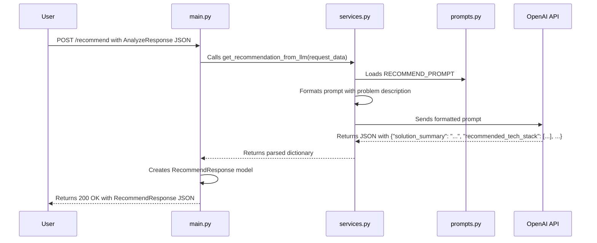

## AI Architect: Deep Dive Documentation

This document provides a detailed look into the internal workings of the AI Architect API, including its architecture, code flow, and the role of each component.

### 1\. System Architecture

The API is designed with a clear separation of concerns, organized into distinct modules that handle specific responsibilities. This modular architecture makes the system easier to understand, maintain, and extend.

### 2\. Component Descriptions

The `src` directory contains the core logic of the application, broken down into the following modules:

  * **`main.py`**: This is the main entry point for the FastAPI application. It is responsible for:

      * Initializing the FastAPI app instance.
      * Defining the API endpoints (`/`, `/analyze`, and `/recommend`).
      * Handling incoming HTTP requests and returning HTTP responses.
      * Orchestrating calls to the service layer (`services.py`) to perform the core business logic.

  * **`models.py`**: This file defines the data structures for the API using Pydantic `BaseModel`. Its purpose is to:

      * Ensure that incoming request bodies match the expected JSON structure.
      * Validate the data types of incoming fields.
      * Serialize the outgoing response data into a well-defined JSON format.
      * Serve as a clear "data contract" for what the API expects and returns.

  * **`services.py`**: This is the business logic layer of the application. It is responsible for:

      * Communicating with the external OpenAI API.
      * Formatting the prompts that are sent to the Large Language Model (LLM).
      * Parsing the JSON responses received from the LLM.
      * Handling potential errors during the LLM interaction.
      * Abstracting the details of the AI interaction away from the main API endpoints.

  * **`prompts.py`**: This module centralizes all the prompt templates used to instruct the LLM. Keeping prompts in a separate file makes them easier to:

      * Read, manage, and update without changing the application logic.
      * Experiment with different prompt engineering strategies.

  * **`config.py`**: This file manages the application's configuration settings. It is responsible for:

      * Loading environment variables from a `.env` file, such as the `TTTR_API_KEY`.
      * Providing a centralized `settings` object that can be imported and used throughout the application.
      * Ensuring that critical configuration, like the API key, is present at startup.

### 3\. Code Flow and Logic

The API's functionality is delivered through a two-step process. Below is a detailed breakdown of the code flow for each step.

#### `/analyze` Endpoint Flow

The goal of this endpoint is to take a user's unstructured problem and convert it into a structured summary with clarifying questions.

1.  The user sends a `POST` request to `/analyze` with a JSON payload containing the `problem_statement`.
2.  The `analyze_problem` function in `main.py` receives the request. The request body is validated against the `AnalyzeRequest` model.
3.  A unique `problem_id` is generated using `uuid`.
4.  The function calls `get_analysis_from_llm` from `services.py`, passing the `problem_statement` string.
5.  In `services.py`, the `ANALYZE_PROMPT` from `prompts.py` is formatted with the user's problem statement.
6.  An API call is made to the OpenAI `chat.completions` endpoint with the prepared prompt.
7.  The LLM returns a JSON object, which is parsed in `services.py` and returned to `main.py`.
8.  `main.py` constructs an `AnalyzeResponse` object from the LLM's output and the generated `problem_id`.
9.  The `AnalyzeResponse` is sent back to the user as the HTTP response.

#### `/recommend` Endpoint Flow

This endpoint takes the structured problem from the `/analyze` step and generates a concrete technical solution.

1.  The user sends a `POST` request to `/recommend` with the full JSON response they received from the `/analyze` endpoint.
2.  The `recommend_solution` function in `main.py` receives the request, and the body is validated by the `RecommendRequest` model.
3.  The function calls `get_recommendation_from_llm` from `services.py`, passing the entire request object.
4.  In `services.py`, the `RECOMMEND_PROMPT` from `prompts.py` is formatted using the `description` from the request data.
5.  An API call is made to the OpenAI service.
6.  The LLM provides a technical recommendation in a JSON format.
7.  The response is parsed in `services.py` and returned as a dictionary to `main.py`.
8.  `main.py` uses this dictionary to populate a `RecommendResponse` model.
9.  The final `RecommendResponse` object is sent to the user.