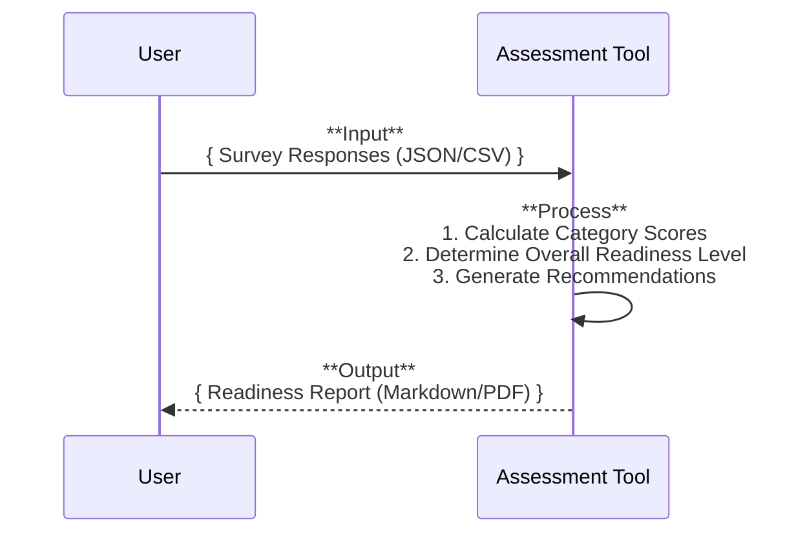

## Software Model: AI Readiness Assessment Tool (Demo Version)

### 1\. Core Concept

This model represents a tool designed to assess a nonprofit's readiness for AI transformation. It functions as a simple, three-step process based on established academic and industry frameworks:

1.  **Survey**: The user completes a structured survey.
2.  **Process**: The tool calculates scores based on the survey responses.
3.  **Report**: The tool generates a report with scores and actionable recommendations.

### 2\. System Behavior (Logical Flow)

The system's behavior is a linear process: the user submits their survey answers, the tool processes them, and a comprehensive report is generated as the final output.



### 3\. Data Structure (The "Language" of the Tool)

These are the simple data structures the tool uses. Using Pydantic models provides a clear and abstract representation of the data.

#### **Input: Survey Responses**

The tool accepts survey data, for example in a JSON format.

```python
# User provides this (example structure):
class SurveyResponse(BaseModel):
    category: str
    question_id: str
    answer: int # Or str for multiple choice

class SurveyInput(BaseModel):
    organization_name: str
    responses: List[SurveyResponse]

```

#### **Output: Readiness Report**

The tool generates a structured report with scores and tailored advice.

```python
# User receives this (example structure):
class CategoryResult(BaseModel):
    category_name: str
    score: int
    recommendations: List[str]

class ReadinessReport(BaseModel):
    organization_name: str
    overall_readiness_level: str # e.g., "Emerging"
    overall_score: int
    category_results: List[CategoryResult]
```

### 4\. Functionality (Tool Definition)

This is a simplified view of what the tool does.

  * **Purpose**: To assess a nonprofit's AI readiness and provide a scored, recommendations-backed report.
  * **Input**: Accepts survey responses in various formats like JSON or CSV.
  * **Output**: Produces a human-readable report (e.g., Markdown) containing category scores, an overall readiness level, and actionable recommendations for each category.