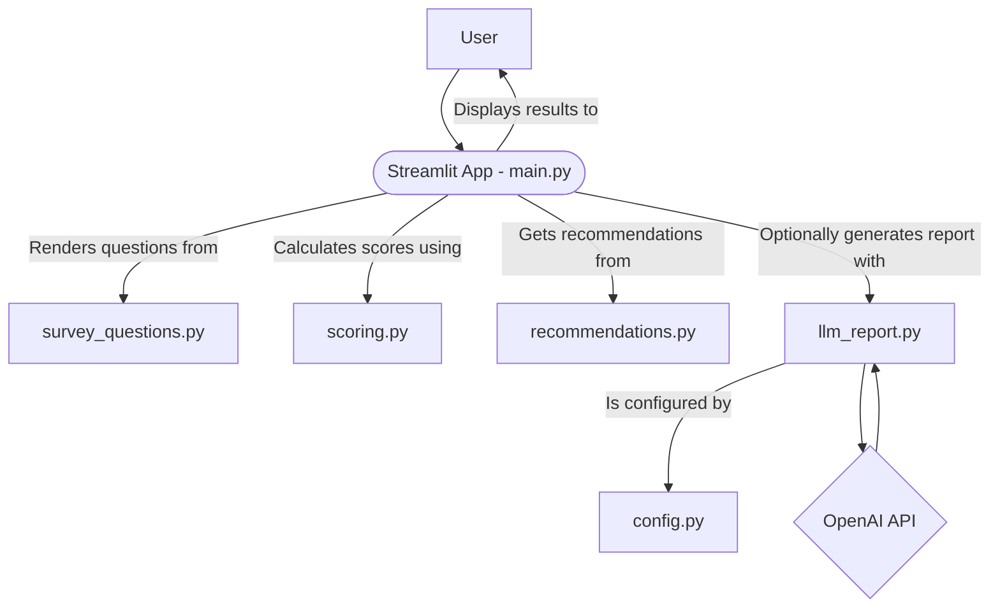
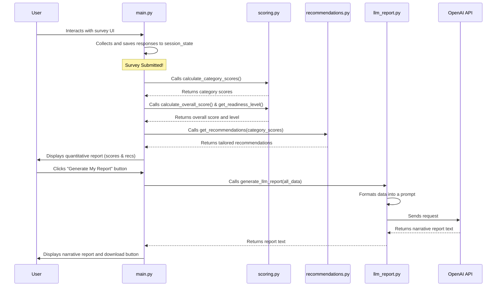

Of course. Here is the in-depth documentation for the AI Readiness Assessment Tool, following the same structure to detail its internal components and code flow.

-----

## AI Readiness Assessment Tool: Deep Dive Documentation

This document provides a detailed technical overview of the AI Readiness Assessment Tool, a Streamlit application designed to help nonprofits evaluate their preparedness for AI transformation.

### 1\. System Architecture

The application is a monolithic but modular Streamlit web app. The architecture is designed to separate concerns, making the logic for survey content, scoring, recommendations, and reporting distinct and manageable.

### 2\. Component Descriptions

The `src` directory contains the core logic of the application, broken down into the following modules:

  * **`main.py`**: This is the primary script that runs the Streamlit application. It orchestrates the entire user experience by:

      * Managing the application's state using `st.session_state` to track survey completion and report generation.
      * Rendering the multi-page survey UI and collecting user responses.
      * Calling the appropriate backend modules (`scoring.py`, `recommendations.py`, `llm_report.py`) to process the data.
      * Displaying the final calculated scores and personalized report.

  * **`survey_questions.py`**: This module acts as a centralized data store for the survey's content. It contains a single dictionary, `SURVEY_QUESTIONS`, which defines the categories, questions, and multiple-choice options. This separation allows for easy updates to the survey content without altering the application's logic.

  * **`scoring.py`**: This is the analytical engine of the tool. It is responsible for all calculations, including:

      * Defining the weights for each assessment category.
      * Calculating a normalized score (0-100) for each category based on user responses.
      * Calculating the final weighted overall readiness score.
      * Mapping the overall score to a specific readiness level (e.g., "Foundational", "Emerging").

  * **`recommendations.py`**: This module functions as a rule-based recommendation engine. The `get_recommendations` function takes the category scores as input and returns a list of actionable, pre-defined recommendations tailored to whether the score is high or low for that specific category.

  * **`llm_report.py`**: This module provides the optional, AI-enhanced reporting feature. It communicates with the OpenAI API to:

      * Take the structured, quantitative results (scores, levels, recommendations).
      * Format them into a detailed prompt for the LLM.
      * Generate a qualitative, human-readable narrative report that explains the results in an encouraging and actionable tone.

  * **`config.py`**: This file handles the application's configuration, specifically for the LLM feature. It loads environment variables like the `TTTR_API_KEY` and model parameters from a `.env` file, making them available to the `llm_report.py` module.

### 3\. Code Flow and Logic

The application follows a linear, state-driven flow from survey completion to report generation.

1.  The user opens the application and interacts with the multi-page survey rendered by `main.py`. The questions and options are pulled from `survey_questions.py`.
2.  Upon submission, the `handle_submit` callback in `main.py` saves the raw survey data into the Streamlit `session_state` and sets a `survey_completed` flag to `True`.
3.  The application re-renders, and because the `survey_completed` flag is true, it now enters the report view.
4.  `main.py` calls the functions in `scoring.py` to calculate the category scores, the weighted overall score, and determine the readiness level.
5.  Next, it calls `get_recommendations` from `recommendations.py`, passing the category scores to get a dictionary of tailored advice.
6.  This initial quantitative report (scores, progress bars, recommendations) is displayed to the user.
7.  The user has the option to click the "Generate My Report" button.
8.  If clicked, `main.py` calls `generate_llm_report` from `llm_report.py`, sending all the calculated data (scores, level, recommendations) as arguments.
9.  `llm_report.py` formats this data into a comprehensive prompt and sends it to the OpenAI API.
10. The LLM generates a narrative report, which is returned to `main.py`.
11. The narrative report is stored in the `session_state` and displayed on the screen, along with a button to download the report as a Markdown file.